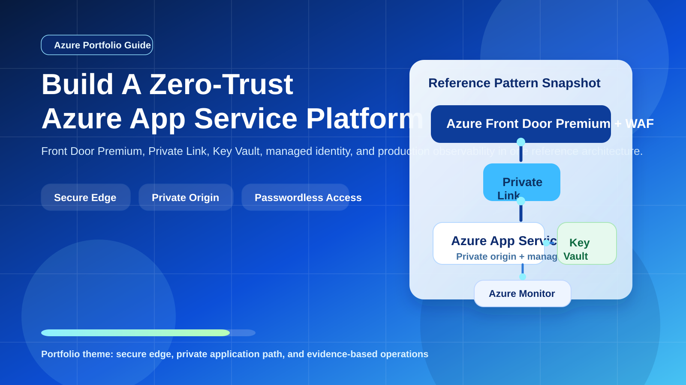
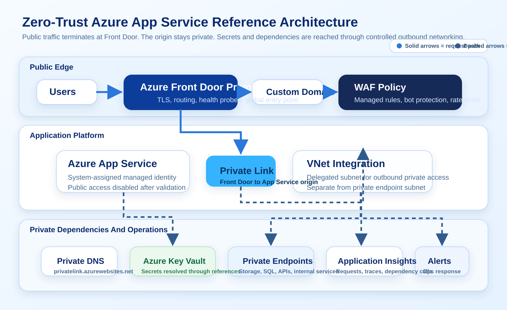
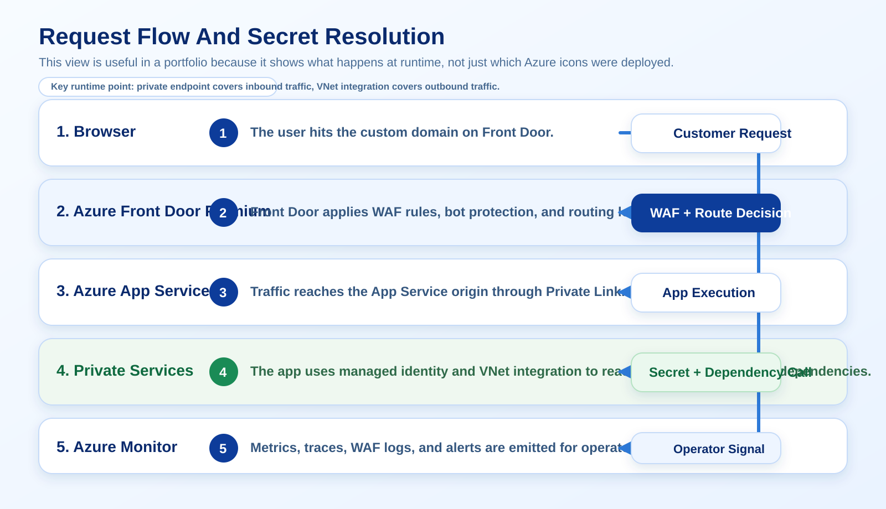
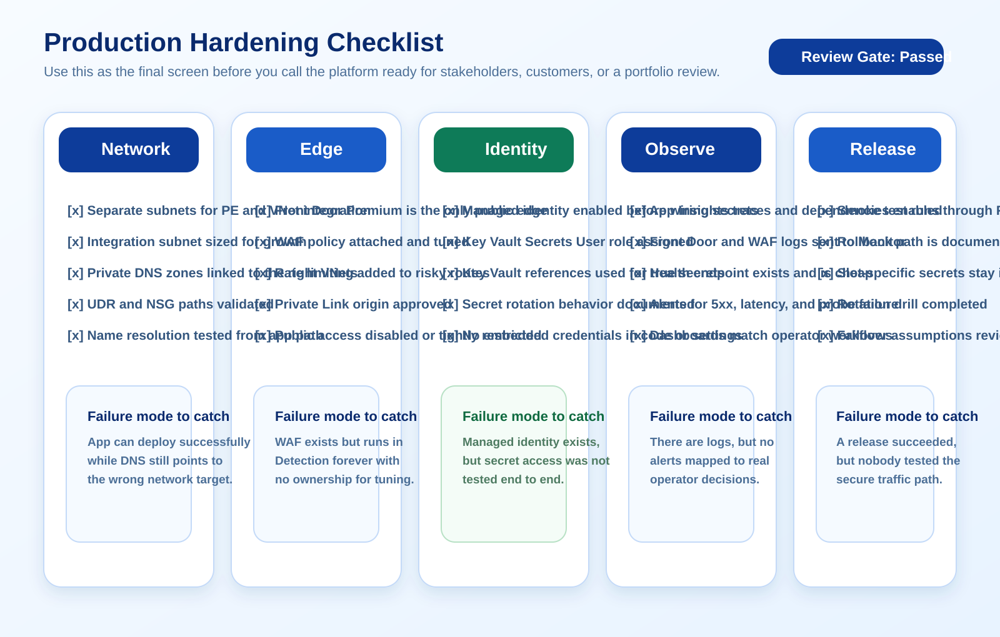

# Build a Zero-Trust Azure App Service Architecture

A portfolio-grade Azure guide for building a secure internet-facing web app with Azure Front Door Premium, Azure App Service, Private Link, managed identity, Key Vault references, and Azure Monitor.

Verified against official Microsoft Learn documentation on March 26, 2026.



## Why This Guide Matters

Plenty of Azure App Service deployments work in production while still exposing too much surface area. The default hostname is public, secrets drift into app settings, Front Door is optional instead of foundational, and outbound networking is treated as an afterthought until private dependencies arrive.

This guide builds a cleaner pattern:

- User traffic lands on Azure Front Door Premium, not directly on the app.
- Web Application Firewall (WAF) policies, rate limiting, and bot protection are enforced at the edge.
- Azure Front Door reaches the App Service origin over Private Link.
- App Service uses VNet integration for outbound access to private dependencies.
- Secrets stay in Key Vault and are resolved through managed identity and Key Vault references.
- Application Insights and Azure Monitor provide operational proof that the design actually works.

This is the kind of architecture that reads well in a portfolio because it demonstrates more than deployment skills. It shows platform thinking across identity, networking, observability, and production hardening.

## Reference Architecture



## What You Are Building

The target pattern is an internet-facing web application with a private origin:

- Azure Front Door Premium is the only public entry point.
- The App Service origin is reached through Private Link.
- The app can still make outbound calls through VNet integration to private services such as Key Vault, storage, databases, or internal APIs.
- Secrets are pulled at runtime with Key Vault references instead of being copied into configuration files.
- Logs, metrics, traces, WAF events, and access decisions are visible in Azure Monitor.

## Core Design Choices

| Service | Purpose | Why it belongs in this pattern |
| --- | --- | --- |
| Azure Front Door Premium | Global edge, TLS termination, WAF, origin routing | Keeps the public edge out of your App Service app |
| App Service private endpoint | Private inbound path to the web app | Eliminates direct origin exposure when public access is disabled |
| App Service VNet integration | Private outbound path from the app | Lets the app reach private endpoints and network-restricted services |
| Managed identity | Passwordless service identity | Replaces embedded credentials with Azure-native authentication |
| Key Vault references | Secret injection into app settings | Keeps runtime configuration clean while preserving secret rotation |
| Azure Monitor and Application Insights | Telemetry, dashboards, alerts | Lets you validate health and investigate failures fast |

## Step 1: Plan The Network Before You Deploy Anything

The first mistake most teams make is trying to bolt networking on after the app already exists. For this pattern, make the network plan explicit up front.

Use separate subnets for separate jobs:

- `snet-appservice-integration` for App Service VNet integration
- `snet-private-endpoints` for private endpoints such as Key Vault, Storage, SQL, or internal APIs

Microsoft Learn is explicit that App Service private endpoints and VNet integration cannot use the same subnet. The VNet integration subnet also needs to be sized for scale and upgrades. Microsoft notes that `/28` is the minimum supported size for an existing subnet, `/27` is the minimum when creating through the portal, and `/26` is the safer planning size for multitenant App Service plans because scaling and platform upgrades temporarily consume extra IPs.

Example IP plan:

```text
vnet-prod-secureapps        10.40.0.0/16
  snet-appservice-integration  10.40.1.0/26
  snet-private-endpoints       10.40.2.0/24
```

The broad rule is simple: inbound private connectivity and outbound private connectivity are different concerns. Model them that way.

## Step 2: Deploy App Service With Managed Identity Enabled

For a serious production pattern, use a plan that gives you room for scale and diagnostics. Premium v3 is a practical default for many portfolio examples because it supports the networking and scaling features people expect to see in a production design.

At deployment time:

- Create the App Service plan.
- Create the web app.
- Turn on system-assigned managed identity immediately.
- Keep the code and runtime simple. The value in this portfolio piece is the platform design.

Example Azure CLI:

```bash
az webapp identity assign \
  --resource-group rg-secure-appsvc \
  --name app-zero-trust-demo
```

That identity becomes the trust anchor for Key Vault references and other Azure resource access.

## Step 3: Move Secrets Out Of App Settings And Into Key Vault

Azure App Service supports Key Vault references as application settings. That means your application still reads a normal environment variable, but the value is resolved from Key Vault instead of being stored directly in App Service.

Microsoft documents two practical rules that matter here:

- Key Vault references use the app's system-assigned identity by default.
- If you do not pin a secret version, App Service automatically picks up the latest version, but the value is cached and refreshed within 24 hours unless you force a refresh or trigger a configuration restart.

Example setting:

```text
ConnectionStrings__Sql=@Microsoft.KeyVault(SecretUri=https://kv-prod-secureapp.vault.azure.net/secrets/sql-connection)
```

Grant the web app identity read access to secrets:

```bash
az role assignment create \
  --assignee <web-app-principal-id> \
  --role "Key Vault Secrets User" \
  --scope $(az keyvault show --resource-group rg-secure-appsvc --name kv-prod-secureapp --query id -o tsv)
```

If your vault is network-restricted, do not rely on App Service outbound public IPs. Microsoft explicitly recommends giving the app network access through a virtual network instead.

## Step 4: Enable Outbound VNet Integration

App Service private endpoint handles inbound traffic only. It does not magically solve outbound connectivity. If your app needs private access to Key Vault, storage, a database, or internal APIs, you need VNet integration.



Important implementation details from Microsoft Learn:

- VNet integration is for outbound traffic from the app.
- The integration subnet must be delegated to `Microsoft.Web/serverFarms`.
- Private endpoint traffic and VNet integration must use different subnets.
- If you apply NSGs or UDRs, you must account for runtime dependencies such as CRL and Microsoft Entra ID endpoints.

If your app is Linux-based and must reach private endpoints, Microsoft specifically calls out `vnetRouteAllEnabled=true` so all traffic is forced through the virtual network:

```bash
az webapp config set \
  --resource-group rg-secure-appsvc \
  --name app-zero-trust-demo \
  --generic-configurations '{"vnetRouteAllEnabled": true}'
```

That setting matters when your app needs deterministic outbound routing to private dependencies.

## Step 5: Wire Private DNS Correctly

Private networking on Azure rarely fails because the service is broken. It usually fails because DNS was treated like an afterthought.

For this pattern, at minimum, think about these zones:

| Service | Private DNS zone |
| --- | --- |
| App Service private endpoint | `privatelink.azurewebsites.net` |
| Key Vault private endpoint | `privatelink.vaultcore.azure.net` |
| Other private dependencies | Service-specific private DNS zones |

For App Service, Microsoft documents that the public app hostname becomes a CNAME chain that points to `*.privatelink.azurewebsites.net`. If the client or Front Door path cannot resolve that private target correctly, your architecture is secure only on paper.

The right validation step is not "the resource deployed." The right validation step is "name resolution returns the private target I expected from the network path I care about."

## Step 6: Put Azure Front Door Premium In Front Of The App

Azure Front Door Premium gives you the edge pattern you want for an MVP-grade article:

- Global entry point
- TLS offload
- WAF policies
- health probes
- origin routing
- Private Link support to App Service

The Microsoft Learn flow for this design is straightforward:

1. Create an Azure Front Door Premium profile.
2. Create an origin group.
3. Add the App Service app as an origin.
4. Enable Private Link and use the `sites` subresource.
5. Approve the pending private endpoint connection from the App Service side.

Two details are easy to miss:

- You cannot mix public and private origins in the same Front Door origin group.
- The private endpoint connection request from Front Door must be approved before the path is usable.

Once that path is working, Front Door becomes the public edge and the app stops needing direct public reachability.

## Step 7: Decide How Public Access Is Handled

The strongest version of this pattern is simple: disable public network access on the App Service app after Front Door Private Link is working.

Microsoft's App Service guidance also documents a fallback pattern if you cannot disable public access yet:

- use App Service access restrictions
- allow only the `AzureFrontDoor.Backend` service tag
- further scope traffic with the `X-Azure-FDID` header so only your specific Front Door instance is accepted

That is still significantly better than leaving the default endpoint broadly reachable, but it is still a compromise compared to a private origin.

Also note a subtle but important rule from Microsoft Learn: access restrictions do not apply to traffic coming through a private endpoint. If you are protecting the app with a private endpoint, your controls shift toward subnet design, NSGs, DNS, and private connectivity governance.

## Step 8: Add WAF Policies That Reflect Real Threat Models

Do not stop at "Front Door exists." Attach a WAF policy and make it intentional.

Microsoft's Front Door WAF guidance highlights capabilities that are worth calling out in a portfolio:

- OWASP-based managed rule sets
- Microsoft Threat Intelligence rules
- bot protection
- rate limiting
- geo-filtering
- custom rule tuning
- Azure Monitor integration for logs

Practical advice:

- Start in Detection mode while tuning false positives.
- Add rate limits for obvious abuse paths such as login or password reset endpoints.
- Turn on bot protection if the app has any public search, form, or account workflow.
- Move to Prevention mode after you understand normal traffic.

This is where your article stops sounding like a tutorial and starts sounding like operational engineering.

## Step 9: Make Observability Part Of The Architecture, Not A Postscript

Your guide becomes stronger when it shows how the team proves the platform is healthy.

Instrument at three levels:

- Application Insights for request traces, dependency calls, failures, and latency
- Azure Front Door and WAF logs for edge behavior
- App Service diagnostics and access restriction audit logs where relevant

Create a simple `/healthz` endpoint and use it consistently:

- Front Door health probes
- synthetic monitoring
- release validation

Do not make health checks expensive. They should prove app readiness, not execute business logic.

## Production Hardening Checklist



Use this checklist before calling the platform production-ready:

- Separate subnets exist for VNet integration and private endpoints.
- The App Service integration subnet is sized for scale and upgrades.
- The app has managed identity enabled before secret wiring.
- Key Vault uses role assignments or access policies that match the app identity.
- Key Vault references are used for secrets, not pasted values.
- Private DNS zones are linked to the right virtual networks.
- Front Door Private Link is approved and functional.
- Public network access is disabled on the app, or tightly constrained with access restrictions if a transition period is required.
- WAF policies are attached, tuned, and monitored.
- Alerts exist for probe failures, origin errors, high latency, and secret resolution issues.
- Secret rotation is tested, including forced refresh behavior when needed.

## Common Mistakes To Avoid

These are the mistakes that cause the most wasted time:

- Using the same subnet for App Service VNet integration and private endpoints
- Under-sizing the integration subnet and discovering the problem during scale operations
- Forgetting to approve the pending Front Door private endpoint connection
- Mixing public and private origins in the same Front Door origin group
- Assuming access restrictions protect private endpoint traffic
- Treating DNS as optional validation instead of a first-class dependency
- Putting every setting in Key Vault, including values that are not actually secrets and are easier to manage directly

## Why This Makes A Strong Portfolio Post

This guide works well for an Azure portfolio because it balances practicality and architecture depth. It does not try to show every Azure feature in one diagram. Instead, it solves one real problem well: how to publish a modern web application on Azure without leaving the origin wide open or turning secret management into a mess.

If you want content that reads like Microsoft MVP-level work, that is the standard to aim for. Clear problem. Defensible architecture. Accurate tradeoffs. Evidence-backed implementation.

## References

- Azure App Service private endpoints: https://learn.microsoft.com/en-us/azure/app-service/overview-private-endpoint
- Azure App Service VNet integration: https://learn.microsoft.com/en-us/azure/app-service/overview-vnet-integration
- Azure Front Door Premium with Private Link to App Service: https://learn.microsoft.com/en-us/azure/frontdoor/standard-premium/how-to-enable-private-link-web-app
- Azure App Service Key Vault references: https://learn.microsoft.com/en-us/azure/app-service/app-service-key-vault-references
- Azure App Service access restrictions: https://learn.microsoft.com/en-us/azure/app-service/overview-access-restrictions
- Azure Front Door WAF: https://learn.microsoft.com/en-us/azure/frontdoor/web-application-firewall
