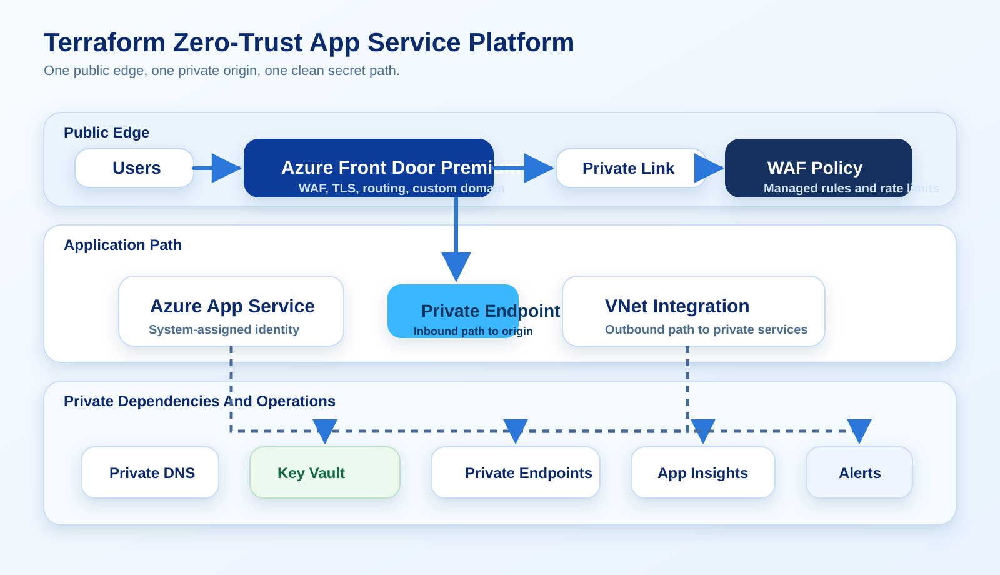

# Terraforming a Zero-Trust Azure App Service Platform

A deep Azure guide for building an internet-facing App Service workload with Terraform using Azure Front Door Premium, Private Link, VNet integration, managed identity, Key Vault references, and Azure Monitor.

Verified against official Microsoft Learn documentation on March 26, 2026.



## Why This Pattern Is Worth Writing About

There are a lot of App Service tutorials that stop at "the app is running." That is not enough for serious Azure work.

The production problem is not whether App Service can serve traffic. The production problem is whether the platform design:

- exposes only one controlled public edge
- keeps the origin private
- resolves secrets without copying them into configuration
- allows outbound access to private dependencies
- remains observable when things go wrong

This guide uses Terraform to implement that model cleanly.

## Target Architecture

The intended request path is:

1. Users hit Azure Front Door Premium on a custom domain.
2. Front Door applies WAF policy and routes traffic to the origin group.
3. The origin is App Service, reached through Private Link.
4. The web app uses VNet integration for outbound calls to Key Vault and other private services.
5. Logs, traces, and metrics land in Azure Monitor and Application Insights.

That split matters because inbound and outbound controls are different in App Service:

- Private endpoint handles inbound connectivity.
- VNet integration handles outbound connectivity.

Microsoft documents that these features must use different subnets. Design around that from day one.

## Recommended Terraform Layout

Keep the layout boring and explicit:

```text
terraform/
  environments/
    prod/
      backend.tf
      main.tf
      variables.tf
      terraform.tfvars
  modules/
    network/
    app_service/
    key_vault/
    frontdoor/
    monitoring/
```

The easiest way to break this platform is to squeeze everything into one root module until every apply becomes risky.

## Network First, Application Second

Start with address space and subnet purpose, not the app code.

Example plan:

```text
vnet-prod-apps            10.40.0.0/16
  snet-appsvc-integration 10.40.1.0/26
  snet-private-endpoints  10.40.2.0/24
```

Microsoft Learn notes that App Service VNet integration subnets need enough IP space for scale operations and upgrades. `/26` is a safer planning size than trying to optimize too early.

Representative Terraform:

```hcl
resource "azurerm_virtual_network" "apps" {
  name                = "vnet-prod-apps"
  location            = azurerm_resource_group.platform.location
  resource_group_name = azurerm_resource_group.platform.name
  address_space       = ["10.40.0.0/16"]
}

resource "azurerm_subnet" "appsvc_integration" {
  name                 = "snet-appsvc-integration"
  resource_group_name  = azurerm_resource_group.platform.name
  virtual_network_name = azurerm_virtual_network.apps.name
  address_prefixes     = ["10.40.1.0/26"]

  delegation {
    name = "appsvc"

    service_delegation {
      name = "Microsoft.Web/serverFarms"
    }
  }
}

resource "azurerm_subnet" "private_endpoints" {
  name                                          = "snet-private-endpoints"
  resource_group_name                           = azurerm_resource_group.platform.name
  virtual_network_name                          = azurerm_virtual_network.apps.name
  address_prefixes                              = ["10.40.2.0/24"]
  private_endpoint_network_policies             = "Disabled"
  private_link_service_network_policies_enabled = false
}
```

## App Service With Identity Enabled Immediately

Do not build the platform first and bolt identity on later. Turn on managed identity at creation time.

```hcl
resource "azurerm_service_plan" "web" {
  name                = "asp-prod-web"
  location            = azurerm_resource_group.platform.location
  resource_group_name = azurerm_resource_group.platform.name
  os_type             = "Linux"
  sku_name            = "P1v3"
}

resource "azurerm_linux_web_app" "web" {
  name                = "app-prod-web-01"
  location            = azurerm_resource_group.platform.location
  resource_group_name = azurerm_resource_group.platform.name
  service_plan_id     = azurerm_service_plan.web.id
  https_only          = true

  identity {
    type = "SystemAssigned"
  }

  site_config {
    minimum_tls_version = "1.2"
    ftps_state          = "Disabled"
  }

  app_settings = {
    "APPLICATIONINSIGHTS_CONNECTION_STRING" = azurerm_application_insights.web.connection_string
    "WEBSITE_RUN_FROM_PACKAGE"              = "1"
    "ConnectionStrings__Sql"                = "@Microsoft.KeyVault(SecretUri=${azurerm_key_vault_secret.sql.versionless_id})"
  }
}

resource "azurerm_app_service_virtual_network_swift_connection" "web" {
  app_service_id = azurerm_linux_web_app.web.id
  subnet_id      = azurerm_subnet.appsvc_integration.id
}
```

The important design choice is not the SKU line. It is the combination of:

- system-assigned identity
- VNet integration
- Key Vault references

That is where the platform starts behaving like an actual production system.

## Key Vault: Secret Store, Not Configuration Dumpster

Key Vault references are excellent for secrets, but they should not become a dumping ground for every setting.

Use Key Vault for:

- passwords
- connection strings
- API tokens
- certificates

Keep non-secret settings in Terraform variables, `.tfvars`, or environment-specific configuration.

Representative Terraform:

```hcl
resource "azurerm_key_vault" "platform" {
  name                          = "kv-prod-secureapp-01"
  location                      = azurerm_resource_group.platform.location
  resource_group_name           = azurerm_resource_group.platform.name
  tenant_id                     = data.azurerm_client_config.current.tenant_id
  sku_name                      = "standard"
  soft_delete_retention_days    = 90
  purge_protection_enabled      = true
  public_network_access_enabled = false
}

resource "azurerm_role_assignment" "web_kv_secrets_user" {
  scope                = azurerm_key_vault.platform.id
  role_definition_name = "Key Vault Secrets User"
  principal_id         = azurerm_linux_web_app.web.identity[0].principal_id
}
```

Microsoft notes that secret refresh through Key Vault references is cached. If you rotate a secret and expect the app to see it instantly without restart or refresh behavior, you will eventually get surprised.

## Private Endpoints And DNS Are Part Of The Same Story

Private endpoint without DNS is an outage waiting to happen.

For this pattern you usually need at least:

- `privatelink.azurewebsites.net`
- `privatelink.vaultcore.azure.net`

Representative Terraform:

```hcl
resource "azurerm_private_dns_zone" "webapp" {
  name                = "privatelink.azurewebsites.net"
  resource_group_name = azurerm_resource_group.platform.name
}

resource "azurerm_private_dns_zone" "vault" {
  name                = "privatelink.vaultcore.azure.net"
  resource_group_name = azurerm_resource_group.platform.name
}
```

## Front Door In Terraform: Use Modules Or Be Very Deliberate

You can build Azure Front Door Premium from raw `azurerm_cdn_frontdoor_*` resources, but this is one place where teams often benefit from a vetted internal module or an Azure Verified Module wrapper.

The module should own:

- profile
- endpoint
- origin group
- origin
- route
- WAF policy
- security policy association

Representative root-module usage:

```hcl
module "frontdoor" {
  source = "../../modules/frontdoor"

  name                = "fd-prod-web"
  resource_group_name = azurerm_resource_group.platform.name
  location            = "global"

  app_service_origin_hostname = azurerm_linux_web_app.web.default_hostname
  app_service_origin_id       = azurerm_linux_web_app.web.id
  custom_domain               = "app.contoso.com"
  enable_private_link         = true
  waf_mode                    = "Prevention"
}
```

The important rollout rule is:

1. Stand up Front Door.
2. Validate the private origin path.
3. Only then lock down or disable public reachability on the app.

If you reverse that order, you create your own outage.

## Observability Should Be Declared, Not Remembered

Instrumentation should be in Terraform so every environment gets the same minimum baseline.

```hcl
resource "azurerm_log_analytics_workspace" "platform" {
  name                = "law-prod-platform"
  location            = azurerm_resource_group.platform.location
  resource_group_name = azurerm_resource_group.platform.name
  sku                 = "PerGB2018"
  retention_in_days   = 30
}

resource "azurerm_application_insights" "web" {
  name                = "appi-prod-web"
  location            = azurerm_resource_group.platform.location
  resource_group_name = azurerm_resource_group.platform.name
  workspace_id        = azurerm_log_analytics_workspace.platform.id
  application_type    = "web"
}
```

## Things Teams Usually Get Wrong

- Using one subnet for both private endpoints and App Service integration
- Forgetting DNS zone links
- Treating Key Vault as a generic config store
- Enabling Front Door without validating private origin approval
- Assuming private endpoint alone solves outbound connectivity

## What Makes This Portfolio-Grade

This is a strong portfolio entry because it demonstrates judgement, not just syntax.

The article shows:

- infrastructure as code discipline
- networking separation of concerns
- identity-first design
- secret hygiene
- platform observability

That combination reads like real Azure engineering work.

## References

- App Service VNet integration: https://learn.microsoft.com/en-us/azure/app-service/overview-vnet-integration
- App Service private endpoint: https://learn.microsoft.com/en-us/azure/app-service/overview-private-endpoint
- App Service Key Vault references: https://learn.microsoft.com/en-us/azure/app-service/app-service-key-vault-references
- Front Door Private Link with Web App: https://learn.microsoft.com/en-us/azure/frontdoor/standard-premium/how-to-enable-private-link-web-app
