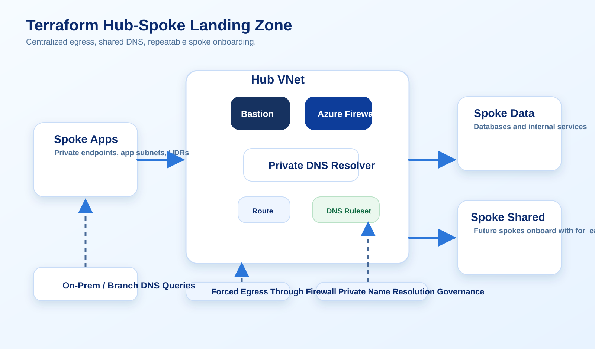

# Terraforming a Hub-Spoke Azure Landing Zone with Firewall and DNS Private Resolver

A deep Azure guide for building a hub-spoke landing zone with Terraform using Azure Firewall, Bastion, route tables, Private DNS Resolver, and reusable spoke onboarding patterns.

Verified against official Microsoft Learn documentation on March 26, 2026.



## Why This Guide Matters

Hub-spoke is one of those Azure patterns everyone claims to understand until the first shared-services migration or DNS incident.

The architecture is not difficult in concept:

- one hub
- many spokes
- centralized egress and shared services

The difficult part is implementation discipline:

- address planning
- subnet reservation
- route intent
- DNS forwarding
- shared state boundaries

That is what this guide focuses on.

## Target Architecture

The platform design is:

- one hub virtual network
- dedicated Azure Firewall subnet
- dedicated Azure Bastion subnet
- Private DNS Resolver inbound and outbound endpoints
- shared route tables for forced egress
- spoke virtual networks attached through VNet peering
- private DNS and forwarding rules handled centrally

This is a good portfolio topic because it demonstrates platform thinking beyond a single workload.

## The First Real Decision: IP Space

Most landing zone pain starts with poor address planning.

Do not plan only for the first spoke. Plan for the fifth, the tenth, and the private endpoint sprawl that arrives later.

Example:

```text
hub-vnet              10.10.0.0/16
  AzureFirewallSubnet 10.10.0.0/24
  AzureBastionSubnet  10.10.1.0/26
  snet-dns-inbound    10.10.2.0/28
  snet-dns-outbound   10.10.2.16/28

spoke-apps-prod       10.20.0.0/16
spoke-data-prod       10.30.0.0/16
```

If you undersize the hub, the future is mostly awkward renumbering conversations.

## Split Terraform By Ownership

The cleanest layout is usually:

```text
terraform/
  environments/
    connectivity-prod/
  modules/
    hub_network/
    firewall/
    dns_resolver/
    spoke_vnet/
    peering/
```

Do not bury every spoke, firewall rule, and resolver rule in one giant root module. Shared connectivity stacks live longer than most application stacks. Treat them accordingly.

## Hub VNet And Reserved Subnets

Representative Terraform:

```hcl
resource "azurerm_virtual_network" "hub" {
  name                = "vnet-hub-prod"
  location            = azurerm_resource_group.connectivity.location
  resource_group_name = azurerm_resource_group.connectivity.name
  address_space       = ["10.10.0.0/16"]
}

resource "azurerm_subnet" "firewall" {
  name                 = "AzureFirewallSubnet"
  resource_group_name  = azurerm_resource_group.connectivity.name
  virtual_network_name = azurerm_virtual_network.hub.name
  address_prefixes     = ["10.10.0.0/24"]
}

resource "azurerm_subnet" "bastion" {
  name                 = "AzureBastionSubnet"
  resource_group_name  = azurerm_resource_group.connectivity.name
  virtual_network_name = azurerm_virtual_network.hub.name
  address_prefixes     = ["10.10.1.0/26"]
}

resource "azurerm_subnet" "dns_inbound" {
  name                 = "snet-dns-inbound"
  resource_group_name  = azurerm_resource_group.connectivity.name
  virtual_network_name = azurerm_virtual_network.hub.name
  address_prefixes     = ["10.10.2.0/28"]
}

resource "azurerm_subnet" "dns_outbound" {
  name                 = "snet-dns-outbound"
  resource_group_name  = azurerm_resource_group.connectivity.name
  virtual_network_name = azurerm_virtual_network.hub.name
  address_prefixes     = ["10.10.2.16/28"]
}
```

These reserved subnets are not optional naming details. Azure services expect them.

## Centralized Egress With Azure Firewall

If the hub is the connectivity control plane, Azure Firewall is usually the place where intent becomes enforceable.

Representative Terraform:

```hcl
resource "azurerm_public_ip" "firewall" {
  name                = "pip-azfw-prod"
  location            = azurerm_resource_group.connectivity.location
  resource_group_name = azurerm_resource_group.connectivity.name
  allocation_method   = "Static"
  sku                 = "Standard"
}

resource "azurerm_firewall_policy" "hub" {
  name                = "afwp-hub-prod"
  location            = azurerm_resource_group.connectivity.location
  resource_group_name = azurerm_resource_group.connectivity.name
  sku                 = "Premium"
}

resource "azurerm_firewall" "hub" {
  name                = "azfw-hub-prod"
  location            = azurerm_resource_group.connectivity.location
  resource_group_name = azurerm_resource_group.connectivity.name
  sku_name            = "AZFW_VNet"
  sku_tier            = "Premium"
  firewall_policy_id  = azurerm_firewall_policy.hub.id

  ip_configuration {
    name                 = "configuration"
    subnet_id            = azurerm_subnet.firewall.id
    public_ip_address_id = azurerm_public_ip.firewall.id
  }
}
```

What matters is not that a firewall exists. What matters is that routing and policy are aligned.

## Forced Egress Means Route Tables, Not Hope

Representative Terraform:

```hcl
resource "azurerm_route_table" "spoke_default" {
  name                = "rt-spoke-default"
  location            = azurerm_resource_group.connectivity.location
  resource_group_name = azurerm_resource_group.connectivity.name
}

resource "azurerm_route" "default_to_firewall" {
  name                   = "default-to-firewall"
  resource_group_name    = azurerm_resource_group.connectivity.name
  route_table_name       = azurerm_route_table.spoke_default.name
  address_prefix         = "0.0.0.0/0"
  next_hop_type          = "VirtualAppliance"
  next_hop_in_ip_address = azurerm_firewall.hub.ip_configuration[0].private_ip_address
}
```

If you want predictable egress, declare it. Do not assume the architecture diagram will enforce itself.

## Private DNS Resolver Is What Makes Shared Name Resolution Work

Hub-spoke networking becomes fragile when each spoke handles private DNS differently.

Private DNS Resolver gives you a cleaner central service for inbound queries from on-premises and outbound forwarding to upstream DNS targets.

Representative Terraform:

```hcl
resource "azurerm_private_dns_resolver" "hub" {
  name                = "pdnsr-hub-prod"
  location            = azurerm_resource_group.connectivity.location
  resource_group_name = azurerm_resource_group.connectivity.name
  virtual_network_id  = azurerm_virtual_network.hub.id
}

resource "azurerm_private_dns_resolver_inbound_endpoint" "hub" {
  name                    = "inbound"
  private_dns_resolver_id = azurerm_private_dns_resolver.hub.id
  location                = azurerm_resource_group.connectivity.location

  ip_configurations {
    private_ip_allocation_method = "Dynamic"
    subnet_id                    = azurerm_subnet.dns_inbound.id
  }
}

resource "azurerm_private_dns_resolver_outbound_endpoint" "hub" {
  name                    = "outbound"
  private_dns_resolver_id = azurerm_private_dns_resolver.hub.id
  location                = azurerm_resource_group.connectivity.location
  subnet_id               = azurerm_subnet.dns_outbound.id
}
```

Add forwarding rulesets only after you know which zones should stay Azure-native and which should forward elsewhere.

## Spoke Onboarding Should Be Data-Driven

Representative `for_each` approach:

```hcl
variable "spokes" {
  type = map(object({
    address_space = list(string)
  }))
}

resource "azurerm_virtual_network" "spokes" {
  for_each            = var.spokes
  name                = "vnet-${each.key}"
  location            = azurerm_resource_group.connectivity.location
  resource_group_name = azurerm_resource_group.connectivity.name
  address_space       = each.value.address_space
}
```

That pattern scales better than copy-pasting spoke definitions until every environment becomes drift-prone.

## Common Landing Zone Mistakes

- Treating hub-spoke like only a peering exercise
- Forgetting route tables when central egress is required
- Mixing DNS forwarding responsibilities across multiple teams
- Making the connectivity state file own every application resource
- Building a firewall without a rule governance process

## Why This Is A Strong Portfolio Entry

This guide signals platform maturity because it is about shared infrastructure, not one application.

It shows:

- topology design
- subnet reservation discipline
- centralized egress control
- DNS strategy
- scalable spoke onboarding

That is exactly the kind of content that strengthens an Azure-focused portfolio.

## References

- Hub-spoke network topology: https://learn.microsoft.com/en-us/azure/architecture/networking/architecture/hub-spoke
- Azure Firewall overview: https://learn.microsoft.com/en-us/azure/firewall/overview
- Azure Private DNS Resolver overview: https://learn.microsoft.com/en-us/azure/dns/dns-private-resolver-overview
