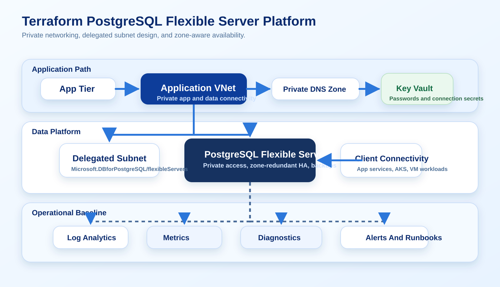

# Terraforming Azure Database for PostgreSQL Flexible Server for Private, Highly Available Workloads

A deep Azure guide for building PostgreSQL Flexible Server with Terraform using delegated subnets, private DNS, private access, zone-redundant high availability, and monitoring.

Verified against official Microsoft Learn documentation on March 26, 2026.



## Why This Guide Matters

Database tutorials often make the server look like the only resource that matters.

In practice, the database is the easy part. The difficult parts are:

- delegated networking
- DNS behavior
- high availability choices
- backup posture
- application connectivity

That is why PostgreSQL Flexible Server is a strong Terraform topic. It forces you to think about the whole data platform path instead of one resource block.

## Target Design

This pattern uses:

- delegated subnet for PostgreSQL Flexible Server
- private DNS zone
- private access only
- zone-redundant high availability where supported
- monitoring and diagnostic settings
- clean separation between network, database, and application modules

## Networking Is The Real First Step

Flexible Server private access requires a delegated subnet. That is not an optional enhancement you add later without consequence.

Representative Terraform:

```hcl
resource "azurerm_virtual_network" "data" {
  name                = "vnet-prod-data"
  location            = azurerm_resource_group.data.location
  resource_group_name = azurerm_resource_group.data.name
  address_space       = ["10.60.0.0/16"]
}

resource "azurerm_subnet" "postgres" {
  name                 = "snet-postgres-flex"
  resource_group_name  = azurerm_resource_group.data.name
  virtual_network_name = azurerm_virtual_network.data.name
  address_prefixes     = ["10.60.1.0/24"]

  delegation {
    name = "postgres-flex"

    service_delegation {
      name = "Microsoft.DBforPostgreSQL/flexibleServers"
    }
  }
}
```

If the subnet is shared casually with unrelated resources, the design gets worse immediately.

## Private DNS Is Part Of The Server Build

Microsoft's Terraform guidance for Flexible Server explicitly includes the private DNS zone and the VNet link as part of the sample topology. That is the right mindset.

Representative Terraform:

```hcl
resource "azurerm_private_dns_zone" "postgres" {
  name                = "prod.postgres.database.azure.com"
  resource_group_name = azurerm_resource_group.data.name
}

resource "azurerm_private_dns_zone_virtual_network_link" "postgres" {
  name                  = "link-data-postgres"
  resource_group_name   = azurerm_resource_group.data.name
  private_dns_zone_name = azurerm_private_dns_zone.postgres.name
  virtual_network_id    = azurerm_virtual_network.data.id
}
```

Treating DNS as part of the database deployment reduces the number of things that can drift silently.

## Server Configuration In Terraform

Representative Terraform:

```hcl
resource "azurerm_postgresql_flexible_server" "primary" {
  name                   = "psql-prod-core-01"
  resource_group_name    = azurerm_resource_group.data.name
  location               = azurerm_resource_group.data.location
  version                = "16"
  delegated_subnet_id    = azurerm_subnet.postgres.id
  private_dns_zone_id    = azurerm_private_dns_zone.postgres.id
  administrator_login    = "pgadmin"
  administrator_password = var.postgres_admin_password
  storage_mb             = 131072
  sku_name               = "GP_Standard_D4ds_v5"
  backup_retention_days  = 14

  high_availability {
    mode                      = "ZoneRedundant"
    standby_availability_zone = "2"
  }
}
```

The big design question is not the `sku_name` string. It is whether the workload actually needs:

- private-only connectivity
- zone redundancy
- higher storage or IOPS assumptions
- longer retention

Those are the decisions that distinguish platform engineering from copy-pasted infrastructure.

## Add The Database Resource, Then Think About Parameters

Once the server exists, teams usually need one or more actual databases and some opinionated server parameters.

Representative Terraform:

```hcl
resource "azurerm_postgresql_flexible_server_database" "app" {
  name      = "appdb"
  server_id = azurerm_postgresql_flexible_server.primary.id
  charset   = "UTF8"
  collation = "en_US.utf8"
}
```

And then tune what matters through explicit configuration rather than folklore.

## Monitoring Is Not Optional For Databases

Database incidents rarely start with a dramatic crash. They usually start with:

- rising latency
- storage pressure
- failover surprises
- connection exhaustion

Terraform should declare the monitoring baseline:

```hcl
resource "azurerm_monitor_diagnostic_setting" "postgres" {
  name                       = "diag-postgres"
  target_resource_id         = azurerm_postgresql_flexible_server.primary.id
  log_analytics_workspace_id = azurerm_log_analytics_workspace.data.id

  enabled_log {
    category = "PostgreSQLLogs"
  }

  metric {
    category = "AllMetrics"
  }
}
```

Without that baseline, the first performance issue turns into a data-collection exercise when it should be a diagnosis exercise.

## What Teams Usually Get Wrong

- Treating delegated subnet design as an afterthought
- Forgetting that private DNS behavior is part of the platform path
- Choosing HA mode without mapping it to actual business RTO expectations
- Leaving database observability out of Terraform
- Putting application and data platform changes into one tightly coupled state file

## Why This Is A Strong Portfolio Entry

This guide is useful in a portfolio because it shows you understand that data services are infrastructure platforms, not just named resources.

It demonstrates:

- delegated networking
- private connectivity design
- HA tradeoffs
- database provisioning discipline
- monitoring baseline design

That is high-value Azure material.

## References

- Deploy PostgreSQL Flexible Server with Terraform: https://learn.microsoft.com/en-us/azure/developer/terraform/azurerm/deploy-postgresql-flexible-server-database
- PostgreSQL Flexible Server networking concepts: https://learn.microsoft.com/en-us/azure/postgresql/flexible-server/concepts-networking-private
- PostgreSQL Flexible Server high availability: https://learn.microsoft.com/en-us/azure/postgresql/flexible-server/concepts-high-availability
