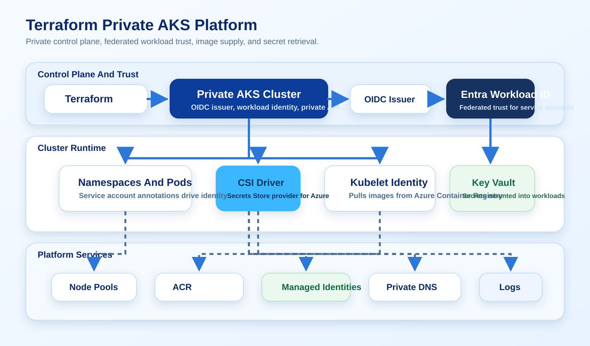

# Terraforming a Private AKS Platform with Workload Identity and Key Vault

A deep Azure guide for building an AKS platform with Terraform using private cluster networking, OIDC issuer, Microsoft Entra Workload ID, Azure Key Vault provider for the Secrets Store CSI Driver, and Azure Container Registry.

Verified against official Microsoft Learn documentation on March 26, 2026.



## Why This Guide Matters

AKS tutorials often optimize for "cluster up in 10 minutes." That is useful for learning, but it is not how platform teams are judged.

Real AKS platform questions are harder:

- How does the API server stay private?
- How do workloads authenticate to Azure without static secrets?
- How does the cluster pull images and read secrets?
- How do DNS, identity, and network design interact?

This guide focuses on those questions.

## Target Platform

The target design is:

- AKS private cluster
- OIDC issuer enabled
- workload identity enabled
- Azure CNI chosen intentionally
- Azure Container Registry for images
- Key Vault provider for Secrets Store CSI Driver
- user-assigned managed identity for workload access
- Terraform for infrastructure, Kubernetes YAML for application identity wiring

That pattern is strong because it avoids the two common anti-patterns:

- public control plane by convenience
- application secrets stored directly in Kubernetes manifests

## Recommended Module Layout

Use a split like this:

```text
terraform/
  environments/prod
  modules/
    network/
    aks/
    acr/
    identity/
    key_vault/
    monitoring/
```

The cluster module should not also own every DNS zone, role assignment, and workload identity detail. That is how Terraform state turns into a liability.

## Private Cluster Design Starts With DNS And Identity

Microsoft documents a few AKS rules that matter immediately:

- A private cluster uses private DNS for API resolution.
- If you use a custom private DNS zone, permissions and subscription registration matter.
- OIDC issuer must be enabled for workload identity scenarios.

That means private cluster work is not only about one boolean flag. It is a coordination exercise across:

- network
- DNS
- cluster identity
- workload identity

## Baseline AKS Terraform

Representative cluster definition:

```hcl
resource "azurerm_kubernetes_cluster" "platform" {
  name                  = "aks-prod-platform-01"
  location              = azurerm_resource_group.platform.location
  resource_group_name   = azurerm_resource_group.platform.name
  dns_prefix            = "aksprodplatform"
  kubernetes_version    = "1.31"
  private_cluster_enabled   = true
  oidc_issuer_enabled       = true
  workload_identity_enabled = true

  default_node_pool {
    name                         = "system"
    vm_size                      = "Standard_D4ds_v5"
    node_count                   = 3
    vnet_subnet_id               = azurerm_subnet.aks_nodes.id
    zones                        = ["1", "2", "3"]
    only_critical_addons_enabled = true
  }

  identity {
    type = "SystemAssigned"
  }

  network_profile {
    network_plugin      = "azure"
    network_plugin_mode = "overlay"
    outbound_type       = "loadBalancer"
    network_policy      = "azure"
  }
}
```

This is the important part:

- `private_cluster_enabled` makes the control plane private
- `oidc_issuer_enabled` gives Entra ID a way to validate projected service account tokens
- `workload_identity_enabled` makes the cluster ready for secretless workload authentication

## Workload Identity Is The Right Authentication Model

Microsoft's current guidance is clear: modern AKS identity access should use Microsoft Entra Workload ID rather than old pod-managed identity patterns.

The flow is:

1. Create a user-assigned managed identity.
2. Grant that identity access to Azure resources such as Key Vault.
3. Create a federated identity credential that trusts the AKS OIDC issuer and a specific Kubernetes service account subject.
4. Annotate the Kubernetes service account so the pod can exchange its projected token for an Azure token.

Representative Terraform for the Azure side:

```hcl
resource "azurerm_user_assigned_identity" "payments" {
  name                = "id-payments-workload"
  location            = azurerm_resource_group.platform.location
  resource_group_name = azurerm_resource_group.platform.name
}

resource "azurerm_role_assignment" "payments_kv" {
  scope                = azurerm_key_vault.platform.id
  role_definition_name = "Key Vault Secrets User"
  principal_id         = azurerm_user_assigned_identity.payments.principal_id
}

resource "azurerm_federated_identity_credential" "payments" {
  name                = "fic-payments"
  resource_group_name = azurerm_resource_group.platform.name
  parent_id           = azurerm_user_assigned_identity.payments.id
  audience            = ["api://AzureADTokenExchange"]
  issuer              = azurerm_kubernetes_cluster.platform.oidc_issuer_url
  subject             = "system:serviceaccount:payments:payments-api"
}
```

And the workload side becomes explicit:

```yaml
apiVersion: v1
kind: ServiceAccount
metadata:
  name: payments-api
  namespace: payments
  annotations:
    azure.workload.identity/client-id: "<user-assigned-managed-identity-client-id>"
```

That is a much better operating model than hiding credentials inside Kubernetes secrets and pretending they are secure because they are base64 encoded.

## Key Vault Provider For Secrets Store CSI Driver

The CSI driver pattern is useful when workloads need mounted secrets, keys, or certificates sourced from Key Vault.

Representative `SecretProviderClass`:

```yaml
apiVersion: secrets-store.csi.x-k8s.io/v1
kind: SecretProviderClass
metadata:
  name: payments-kv
  namespace: payments
spec:
  provider: azure
  parameters:
    usePodIdentity: "false"
    clientID: "<user-assigned-managed-identity-client-id>"
    keyvaultName: "kv-prod-platform-01"
    tenantId: "<tenant-id>"
    objects: |
      array:
        - |
          objectName: payments-db-password
          objectType: secret
```

## Container Registry And Pull Permissions

Do not forget image pull permissions in the platform story.

Representative Terraform:

```hcl
resource "azurerm_container_registry" "platform" {
  name                = "acrprodplatform01"
  location            = azurerm_resource_group.platform.location
  resource_group_name = azurerm_resource_group.platform.name
  sku                 = "Premium"
  admin_enabled       = false
}

resource "azurerm_role_assignment" "aks_acr_pull" {
  scope                = azurerm_container_registry.platform.id
  role_definition_name = "AcrPull"
  principal_id         = azurerm_kubernetes_cluster.platform.kubelet_identity[0].object_id
}
```

## What To Decide Up Front

These decisions should happen before the first `terraform apply`:

- Do you want Azure CNI overlay or VNet mode?
- Will private DNS be system-managed or custom?
- Which workloads need dedicated identities?
- Will secrets be mounted, synced, or both?
- Which namespaces are allowed to map to which identities?

If you skip those decisions, teams create one-off exceptions until the platform becomes inconsistent.

## Common Failure Modes

- Creating a private cluster without thinking through private DNS ownership
- Enabling the CSI driver but not granting Key Vault permissions to the workload identity
- Mixing old pod identity concepts with workload identity patterns
- Letting every application team reuse the same managed identity

## Why This Is A Strong Portfolio Entry

This guide shows more than AKS syntax.

It shows:

- control plane privacy
- token-based Azure authentication
- Kubernetes-to-Azure trust mapping
- secret retrieval without static credentials
- image supply path design

That is real platform engineering, and it reads that way.

## References

- AKS Terraform quickstart: https://learn.microsoft.com/en-us/azure/aks/learn/quick-kubernetes-deploy-terraform
- AKS private clusters: https://learn.microsoft.com/en-us/azure/aks/private-clusters
- AKS OIDC issuer: https://learn.microsoft.com/en-us/azure/aks/use-oidc-issuer
- AKS Secrets Store CSI Driver: https://learn.microsoft.com/en-us/azure/aks/csi-secrets-store-driver
- AKS CSI identity access with workload identity: https://learn.microsoft.com/en-us/azure/aks/csi-secrets-store-identity-access
